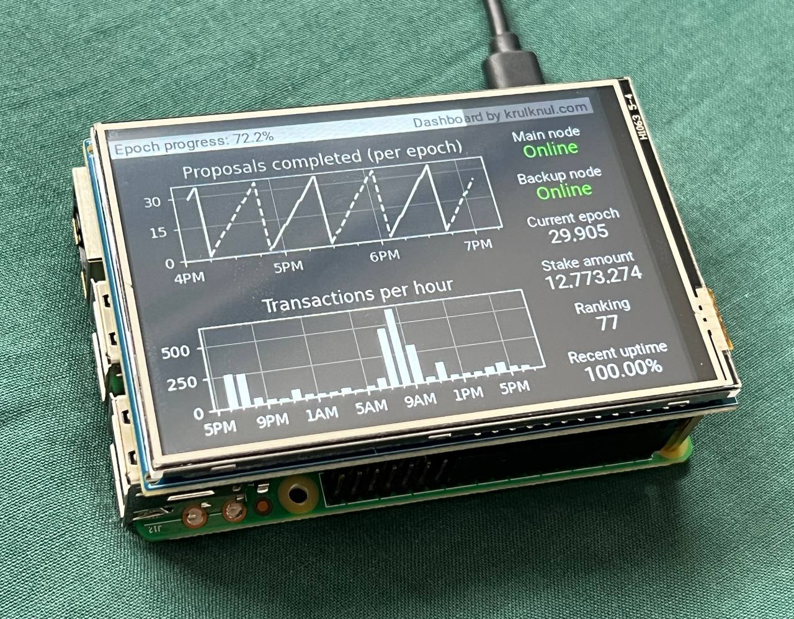

# Raspberry Pi Radix Validator Dashboard

This application for Raspberry Pi serves as a graphical dashboard for a Radix Validator. It is a Kivy-based Python application that fetches data and displays it in a user-friendly format. It uses Grafana and the Radix Gateway for data fetching, and matplotlib for data visualization.

This app works with python 3.9

Here is my Raspberry Pi running the application.
I have a Pi 3B and I bought [this](https://www.kiwi-electronics.com/nl/3-5inch-rpi-lcd-480x320-ips-resistief-touchscreen-4418?search=raspberry%20pi%20displays&page=2) display for it:



## Application Structure
- `app.py`: The main application file.
- `requirements.txt`: Lists the Python dependencies needed by the application.
- `env.template`: A template for the environment variables required by the application.
- `up.sh`: A bash script to set up the environment and run the application.
- `graphs`: A directory containing code related to data visualization.
- `fetcher`: A directory containing code related to data fetching.
- `widgets`: A directory containing custom widgets used in the application.
- `media`: A directory containing media files.
## How to Run the App

### Requirements
* Active Radix validator.
* Accessible Grafana instance set up with the validator.

### Getting started
1. Clone this repository.
2. Navigate to the directory of the cloned repository.
3. Set the required environment variables. You can use the `env.template` file as a base. Make a copy of `env.template`, name it `.env`, and fill in your values.

```bash
cp env.template .env
nano .env
```


Save and close the file when you're done.
4. Run the `up.sh` script. It will automatically create a virtual environment and install the dependencies.

```bash
./up.sh
```

Please note that you might need to adjust the `up.sh` script depending on your system, especially the line that sets the `DISPLAY` environment variable.

## Supporting this project

If you like this project, please consider staking to my validator node to support me and my other projects. [More info](https://krulknul.com)

Or consider contributing to this project
## Contributing

Contributions to this project are welcome. Please open an issue or submit a pull request.
